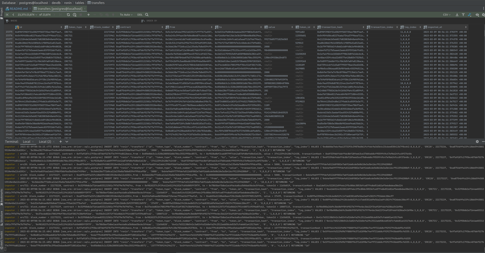

# Ronin Transfer Events INGESTOR

- we don't have `call_traces` from given ronin node, therefore, we are limited to scratch just the surface of EVM data.
If we had `transaction_traces` endpoint working, we could not only see token from A to B and payment from B to A,
but we would be able to see even if it was from sale or staking, therefore much richer experience.
- http JSON RPC was provided. If we had a websocket version (wss://...) we could create a stream and once ingestor 
reaches the last blocks, it will continue ingesting blocks indefinitely. 
- the code is storing transfers one by one; we could optimize by storing in batch.
- I'm just showing here how we can get the latest activity of user by just listening to events from a chain.

### Dependencies

- direnv (https://direnv.net/) - this will load `.envrc` file into terminal session so that next command like `docker` 
will have our env variables ready to use

Look into `.envrc` to see/change some basic configs

## Run locally:

    direnv allow  // to activate .envrc in terminal session
    docker compose up  // to start DB and ingestor

After ingestor finishes ingesting the events from the last 1 000 000 blocks, it will die, and only DB will stay running
this will make postgres available locally on port 5432, make sure that port is free beforehand. While DB is up and
running, you can run python API to read data using new `GET /events/{ronin_address}` endppoint.

## Migration

Migrations are automated and are run at `Ingestor` start. Basically, it checks if there is anything new to migrate or not.